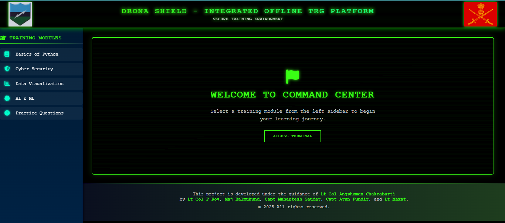

# Drona-Shield

# Indian Army Project - Landing Page

> ⚠️ **Confidential Project Notice**  
> This repository is part of a confidential project for the Indian Army.  
> Specific details about the functionality and purpose of this project are restricted and cannot be disclosed publicly.  

---

## Overview

This repository contains the **landing page** implementation for the project.  
The page is built using:

- **HTML5** for structure  
- **CSS3** for styling and responsiveness  
- **Vanilla JavaScript (ES6)** for interactivity  

The design focuses on a clean interface, performance, and compatibility across modern browsers.

---

## Features

- Responsive and mobile-friendly layout  
- Lightweight and fast-loading  
- Interactive elements with Vanilla JS  
- Clean and modular code for easy maintenance  

---

## ScreenShot



## Getting Started

1. Clone the repository:
   ```bash
   git clone https://github.com/Tanukash12/Drona-Shield.git
2. Navigate into the folder:
   ```bash
   cd contest
3. Open index.html file 


